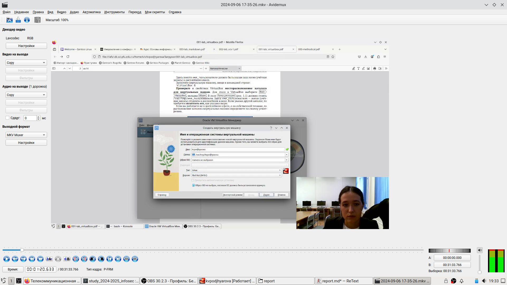
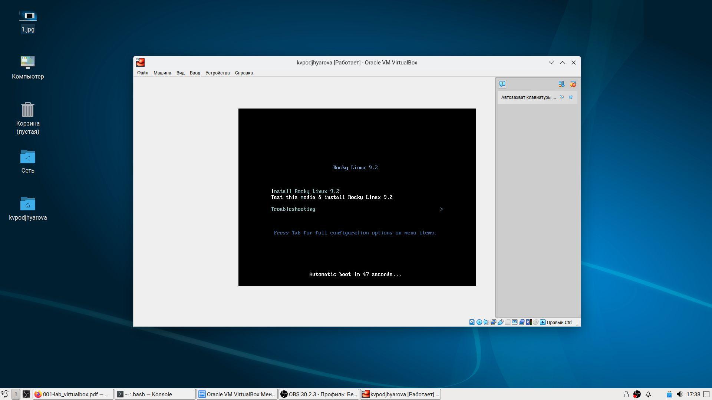
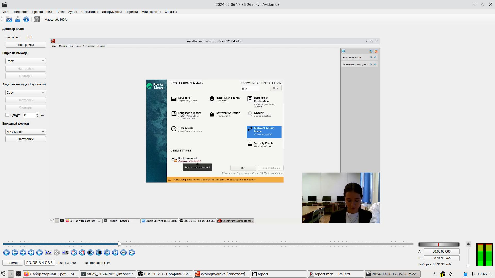
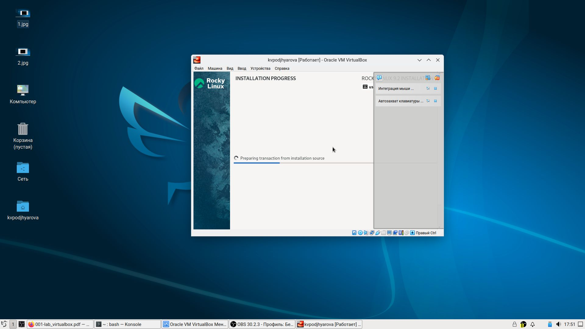
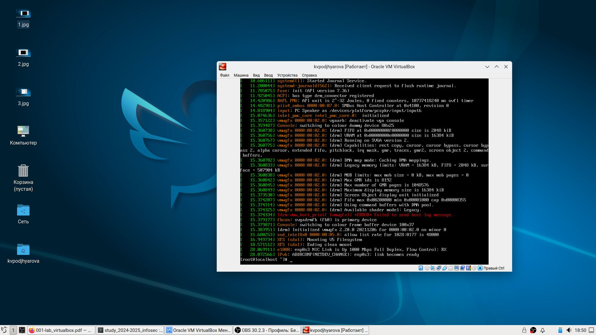
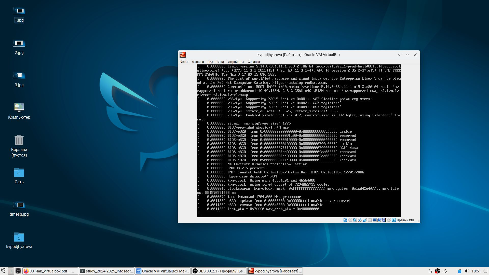
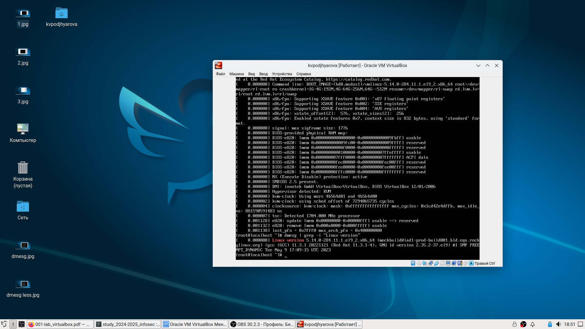
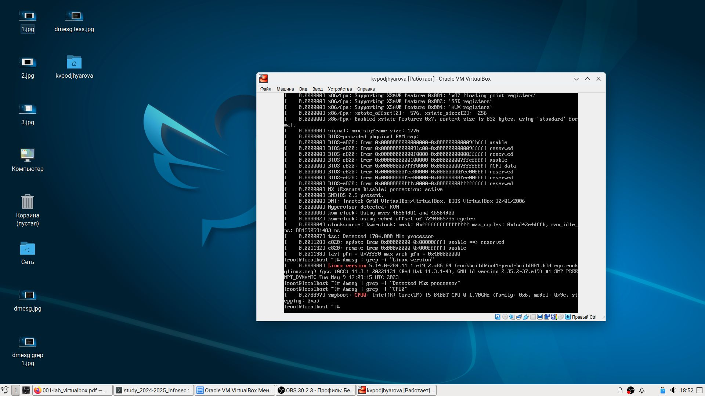
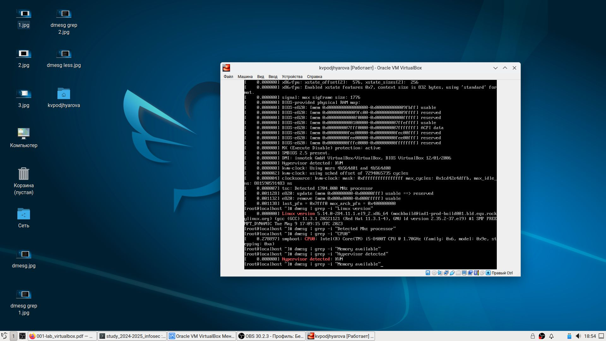
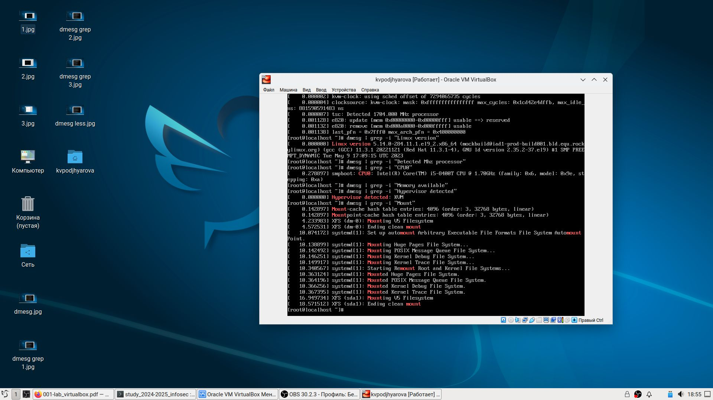

---
## Front matter
lang: ru-RU
title: Лабораторная работа №1
author: |
	Подъярова Ксения Витальевна
institute: |
	Российский университет дружбы народов
date: 2024

## Formatting
toc: false
slide_level: 2
theme: metropolis
header-includes: 
 - \metroset{progressbar=frametitle,sectionpage=progressbar,numbering=fraction}
 - '\makeatletter'
 - '\beamer@ignorenonframefalse'
 - '\makeatother'
aspectratio: 43
section-titles: true
---

## Цель работы

Целью данной работы является приобретение практических навыков установки операционной системы на виртуальную машину, настройки минимально необходимых для дальнейшей работы сервисов.

# Выполнение лабораторной работы

Для начала с официального сайта была скачана и установлена VirtualBox.
Далее запускаем VirtualBox, выбираем “Создать”. В появившемся окне указываем имя ОС (kaleontjeva) и тип ОС (Linux, Red Hat(64-bit))  (рис. [-@fig:001])

{ #fig:001 width=50% }

## Выполнение лабораторной работы

Указываем объём памяти - 2048 МБ. Создаем новый динамический виртуальный жёсткий диск: задаем его тип -
VDI, формат хранения - динамический и размер файла - 40 ГБ и длаем все по инструкции, указанной на ТУИС.

## Выполнение лабораторной работы

Запускаем виртуальную машину (рис. [-@fig:002])

{ #fig:002 width=50% }

## Выполнение лабораторной работы

Переходим к настройке машины. (рис. [-@fig:003])

Выбираем английский язык. Выбираем языки раскладки и комбинацию клавиш для переключения между ними. Выбираем программы: базовое окружение Server with GUI и дополнение Development Tools. Отключаем KDUMP. Включаем сетевое соединение и в качестве имени узла указываем kvpodjhyarova.localdomain. Устанавливаем пароль для root. Чтобы подключить образ диска дополнений гостевой ОС, сначала удаляем устройство в разделе “Носители” и оставляем диск пустым. 

## Выполнение лабораторной работы

Таким образом, установили операционную систему Linux с дистрибутивом Rocky, а также дополнения гостевой ОС, благодаря которым теперь не нужно нажимать хост-клавишу для переключения мышки между двумя ОС и можно настроить разрешение экрана.

{ #fig:003 width=50% }

## Выполнение лабораторной работы

Перезагружаем виртуальную машину. (рис. [-@fig:004])

{ #fig:004 width=50% }

# Домашнее задание

Загружаем графическое окружение и открываем консоль. Анализируем последовательность загрузки системы, используя команду “dmesg” и введя пароль (рис. [-@fig:005])

{ #fig:005 width=50% }

## Домашнее задание

Смотрим вывод этой команды, выполнив “dmesg | less”. В данном случае после каждого нажатия клавиши “Enter” в консоли отображается только одна команда. (рис. [-@fig:006])

{ #fig:006 width=50% }

## Домашнее задание

Далее получаем следующую информацию
1. Версия ядра Linux: dmesg | grep -i “Linux version”. Ответ: 5.14.0- 70.13.1.el9_0.x86_64 (рис. [-@fig:007])

{ #fig:007 width=50% }

## Домашнее задание

2. Частота процессора: dmesg | grep -i “Mhz”. Ответ: 2419.204 MHz

## Домашнее задание

3. Модель процессора: dmesg | grep -i “CPU0”. Ответ: 11th Gen Intel(R) Core(TM) i5-1135G7 @ 2.40GHz (рис. [-@fig:008])

{ #fig:008 width=50% }

## Домашнее задание

4. Объём доступной оперативной памяти: dmesg | grep -i “Memory”. Ответ: 2096696K

## Домашнее задание

5. Тип обнаруженного гипервизора: dmesg | grep -i “Hypervisor detected”. Ответ: KVM (рис. [-@fig:009])

{ #fig:009 width=50% }

## Домашнее задание

6. Тип файловой системы корневого раздела и последовательность монтирования файловых систем: dmesg | grep -i “Mount”. Ответ: XFS (рис. [-@fig:010])

{ #fig:010 width=50% }

# Выводы

## Выводы

В ходе выполнения данной лабораторной работы я приобрела практические
навыки установки операционной системы на виртуальную машину и настройки
минимально необходимых для дальнейшей работы сервисов.

## {.standout}

Wer's nicht glaubt, bezahlt einen Taler
